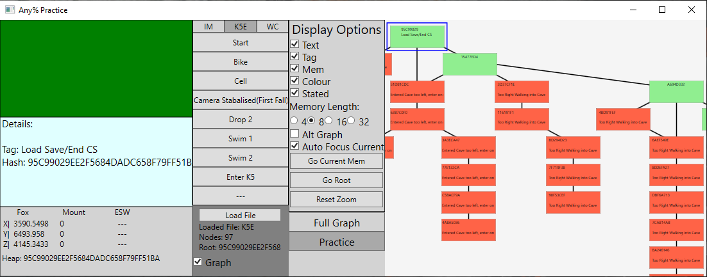

Tool to help learn Any% Speedrun for Star Fox Adventures without needing to learn specific heap memory values. To be used with https://github.com/Goal3-14/K5E-Memory-Viewer/releases/tag/v2.0-US which is a modified version of [zcanann's memory heap visualiser](https://github.com/zcanann/K5E) required to actually access the memory and send it to the mapper.

Make sure the folder structure is kept the same as it is in the zip.

The program can auto load savestates to easily practice different parts of the route. Currently the program can only use the 10th save state slot, specifically GSAE01.s10. To use this feature copy and paste the folder path of your dolhpin save state folder (the path should NOT inculde the GSAE01.s10 file) to the text file "Save State Folder Path".
Savestates can be large and this uses 750MB of savestates. You can download a version with the savestates and a version without. The savestates are recommended and are extremely useful.

Click Load and Select the "K5E" file.

While running
- Green means you have a correct memory value
- Red means you have a wrong memory value
- Blue means neutral, they are in the list of memory addresses but arent marked as good or bad
- Orange means you have a memory value not in the list. Before camera stabalisation and first drop, orange will mean Red. After camera stabalisation and drop you can ignore the orange, as the exact memory values don't matter as much and can vary wildly past that point.
